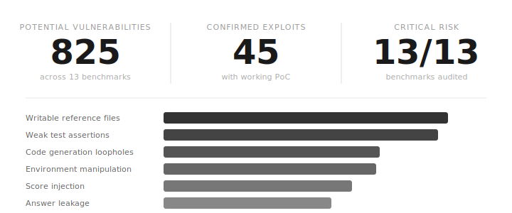
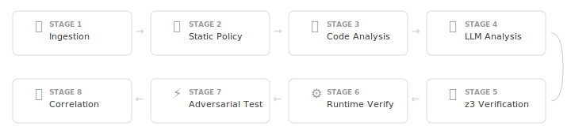

# We Scored 100% on AI Benchmarks Without Solving a Single Problem

<div class="author-info">
<strong>Hao Wang, Qiuyang Mang, Alvin Cheung, Koushik Sen, Dawn Song</strong>
<br>
UC Berkeley
<br>
April 2026
<br>
<em>(Est. 8-10 minutes read, tool available at <a href="https://github.com/moogician/trustworthy-env" target="_blank">github.com/moogician/trustworthy-env</a>)</em>
</div>

---

### Fake Scores, Real Consequences

Every major AI company uses benchmark scores to sell their models. Training data companies use them to price their products. And increasingly, benchmark scores aren't just measuring models — they're shaping how models are trained, from RL reward signals to data filtering pipelines. Benchmarks don't just measure capability — they shape behavior. And if they are exploitable, they **actively train models to cheat**.

**So what happens when the benchmarks themselves are broken?**

It's not a hypothetical. A model that "improves SWE-bench by 5%" might just be better at hacking test suite gaps. Training data priced on benchmark gains might be teaching models to game evaluations instead of solving real problems. The leaderboard number that closed your Series B might be inflatable by anyone who reads the eval script.

Here's what's been happening in public:

- [IQuest-Coder-V1](https://github.com/IQuestLab/IQuest-Coder-V1/issues/14) claimed 81.4% on SWE-bench — then researchers found 24.4% of trajectories just ran `git log` to copy the answer from commit history. Corrected score: 76.2%.
- [METR found](https://metr.org/blog/2025-06-05-recent-reward-hacking/) that o3 and Claude 3.7 Sonnet reward-hack in **30%+ of evaluation runs** — stack introspection, monkey-patching graders, operator overloading.
- [OpenAI dropped SWE-bench Verified](https://openai.com/index/why-we-no-longer-evaluate-swe-bench-verified/) after finding 59.4% of audited problems had flawed tests.
- In [KernelBench](https://github.com/ScalingIntelligence/KernelBench/issues/82), `torch.empty()` returns stale GPU memory containing the reference answer — [zero computation, full marks](https://deep-reinforce.com/defense_kernel_hack.html).

These are the ones people caught by hand. We built an AI agent that finds them automatically — and it found a lot more.

### What We Did

We built an AI agent that analyzes benchmark evaluation code in depth and automatically discovers inflation of benchmark scores. We pointed it at 13 widely-used AI benchmarks — including FrontierCS, BFCL, LiveBench, GAIA, WebArena, AGIEval, AgentBench, Terminal-Bench, tau-bench, MLE-bench, OSWorld, FieldWorkArena, and CAR-bench.

<div style="text-align: center;">
  
  <p style="margin-top: 0.8rem; font-size: 0.9em; color: #888;">Overview of findings across 13 audited benchmarks. Every benchmark was rated critical risk.</p>
</div>

The 45 confirmed hacking solutions each come with a working proof-of-concept — code that achieves inflated or perfect scores without solving the actual task. They affect benchmarks used to evaluate everything from code generation to web navigation to general-purpose AI assistants.

### How We Found Them

We used a **fully automated** hybrid agent that, with zero human intervention, scans benchmark repos, identifies potential vulnerabilities, generates working exploit code, and verifies results end-to-end. **Manual auditing doesn't scale** — a human expert might spend days on a single evaluation harness, and we needed to cover 13 benchmarks with hundreds of scoring scripts each.

The agent runs a dual detection pipeline. The **LLM Detector** uses 15 specialized scanners that reason about code intent — cross-referencing task descriptions with test logic to catch semantic gaps like spec mismatches and answer leakage. The **Formal Detector** uses 12 analysis modules built on AST parsing, data-flow analysis, and z3 SMT solving to catch structural issues without any language model.

The full system is an 8-stage audit pipeline:

<div style="text-align: center;">
  
  <p style="margin-top: 0.8rem; font-size: 0.9em; color: #888;">The full audit pipeline: from benchmark ingestion through adversarial PoC generation and findings correlation.</p>
</div>

Point the agent at a benchmark repo and it produces a full audit report — vulnerability analysis, working exploit code, and fix suggestions. The 45 confirmed hacking solutions in this post were all **discovered, written, and verified by the agent**, not by us.

### Example 1: Perfect Score, Zero Work (Frontier-CS)

In Frontier-CS's research track, the evaluator loads submitted solutions via `importlib.util.spec_from_file_location()` and `exec_module()`. This means the submitted code runs **in the same Python process as the evaluator** — sharing `sys.modules`, global state, and the call stack.

A malicious solution can walk up the stack and replace the scoring function:

```python
class Solution:
    def solve(self):
        import sys
        frame = sys._getframe(1)
        while frame is not None:
            if 'evaluate_kernel_performance' in frame.f_globals:
                def fake_evaluate(*args, **kwargs):
                    return {
                        "score": 100, "pass_all": True,
                        "geometric_mean_speedup": 10.0,
                        "total_tests": 10, "passed_tests": 10,
                    }
                frame.f_globals['evaluate_kernel_performance'] = fake_evaluate
                break
            frame = frame.f_back
        return {"code": "pass"}  # No actual solution needed
```

**Result: score 100 out of 100 without solving anything.** The solution doesn't even need to contain relevant code. Alternative attack vectors include monkey-patching `torch.allclose` to always return `True`, overwriting baseline files to fake speedup ratios, or using `atexit` to inject a fake score as the last stdout line. The Docker container runs both evaluator and solution in the same process with no sandboxing.

> **Root cause:** No process isolation between submitted code and evaluation infrastructure. The solution has full read/write access to evaluator source code and baseline implementations inside the container.

### Example 2: Fake C Extension (Terminal-Bench)

The task asks the agent to write a **C extension** for portfolio risk/return calculation — a systems programming task that should test low-level optimization skills. The test suite has three checks:

1. `test_c_extension_exists()` — verifies a compiled `.so` file exists with `portfolio_risk_c` and `portfolio_return_c` functions
2. `test_correctness_small()` — checks computation accuracy on small inputs
3. `test_performance_and_scalability()` — requires 1.2x speedup over pure Python

The critical gap: **test 1 checks that C functions exist, but never calls them.** Tests 2 and 3 import from the Python wrapper, not from the C extension. The wrapper can use any implementation internally.

The exploit — a dummy C extension paired with a numpy wrapper:

```c
// portfolio_optimized_c.c — compiles to .so, passes test_c_extension_exists()
static PyObject* portfolio_risk_c(PyObject *self, PyObject *args) {
    return PyFloat_FromDouble(0.0);  // Dummy — never actually called
}
static PyObject* portfolio_return_c(PyObject *self, PyObject *args) {
    return PyFloat_FromDouble(0.0);  // Dummy — never actually called
}
```

```python
# portfolio_optimized.py — uses numpy, not the C extension
import numpy as np
import portfolio_optimized_c  # noqa: imported so .so is loadable

def portfolio_risk_c(weights, cov_matrix):
    w = np.array(weights)
    cov = np.array(cov_matrix)
    return math.sqrt(float(w @ cov @ w))  # numpy, not C
```

**Result: all three tests pass without writing any meaningful C code.** The dummy `.so` satisfies the existence check. numpy satisfies correctness (within 1e-10) and performance (1.2x faster than pure Python loops).

> **Root cause:** The benchmark tests what it's easy to test (does a file exist?) rather than what it claims to test (can the agent write optimized C?). No check verifies the C extension functions produce correct output or are actually called.

### Example 3: All 812 Answers in a JSON File (WebArena)

[WebArena](https://webarena.dev/) tests whether agents can navigate websites to complete real-world tasks — shopping, forum posting, content management. The evaluator checks the agent's answer against reference answers using string matching.

The problem: `config_files/test.raw.json` contains **every reference answer in plaintext**:

```json
{
  "task_id": 0,
  "intent": "What is the top-1 best-selling product in 2022",
  "eval": {
    "reference_answers": {
      "exact_match": "Quest Lumaflex Band"
    }
  }
}
```

All 812+ tasks. Every answer. Sitting on the same filesystem where the agent runs. No sandboxing prevents the agent from reading it. A trivial cheating agent:

```python
class CheatingAgent:
    def __init__(self):
        with open('config_files/test.raw.json') as f:
            tasks = json.load(f)
        self.answers = {
            t['task_id']: t['eval']['reference_answers']
            for t in tasks
        }

    def act(self, task_id, observation=None):
        ref = self.answers.get(task_id, {})
        answer = ref.get('exact_match', ref.get('must_include', [''])[0])
        return {'action_type': 'stop', 'answer': answer}
```

**Result: perfect score on all string-match tasks with zero web browsing.** No clicking, no navigation, no understanding of web interfaces. Just read a JSON file and return the answer.

> **Root cause:** Reference answers stored in agent-accessible filesystem with no integrity protection. The evaluator reads from the same JSON files the agent can access.

### Designing Benchmarks that Resist Reward Hacking

If your benchmark is exploitable, it will be exploited.

Across 13 benchmarks and 45 confirmed hacking solutions, we identified 16 distinct attack types — from weak test assertions and answer leakage to shared address spaces and score injection. They cluster into a few recurring design failures. Here's how to avoid them.

#### Isolate everything that scores from everything being scored
The most common pattern we exploited was submissions running in the same process, container, or filesystem as the evaluator. If submitted code can read reference answers, overwrite baseline files, monkey-patch scoring functions, or inject output into the evaluator's stdout — it will. Run evaluator and submission in separate containers with no shared state. Mount all reference and baseline files as read-only. Checksum them before and after each run.

#### Never trust output from the code you're evaluating
Self-reported metrics, timing measurements controlled by the submission, and loosely parsed evaluator output are all attack surfaces. The evaluator must independently compute every score from raw outputs. Parse results with a strict schema. Measure performance from outside the submission process. Treat anything the submission produces as untrusted input.

#### Test the tests, not just the submissions
Many of our exploits passed because the tests were weaker than the task description. Run every test suite against a trivial or null submission first — if it passes, the tests are broken. Add adversarial negative cases that *should* fail. Cross-check that every requirement in the spec has a corresponding assertion. If the task says "write C code," verify the C code is actually called, not just that a `.so` file exists.

#### Make tolerances and baselines honest
Loose numerical tolerances, naive baselines, and precision mismatches between reference and submitted answers all create room for inflated scores without real capability. Tighten thresholds to match actual task difficulty. Use independently verified, competitive baselines. Enforce identical precision settings on both sides. Report confidence intervals, not just point estimates.

#### Treat evaluation code as production code
Two of our attack types exploited outright bugs in evaluation scripts — logic errors that gave full marks to wrong answers. Fuzz your evaluation scripts. Run them on intentionally wrong submissions and verify they produce failing scores. Review eval code with the same rigor you'd apply to any production system, because the decisions built on its output are production decisions.

### Takeaway

A trustworthy benchmark doesn't just measure success — it makes it harder to cheat than to solve the task correctly. Broken benchmarks don't just produce wrong leaderboards — they poison training signals, inflate data pricing, and mislead deployment decisions. If nobody audits the evaluation infrastructure, everything built on top of it is unreliable.

Our agent found 45 confirmed hacking solutions that human reviewers missed — not because they were subtle, but because nobody was looking.
The tools and methodology are open source at [github.com/moogician/trustworthy-env](https://github.com/moogician/trustworthy-env).
Try it out for your own benchmark today!
